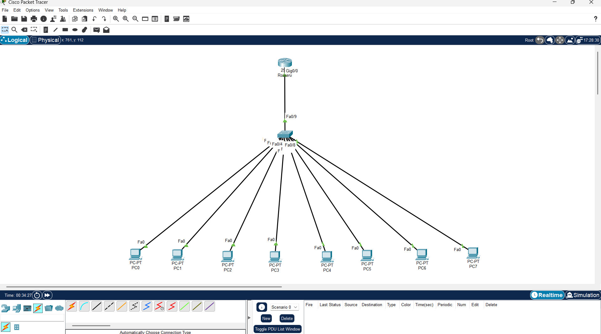
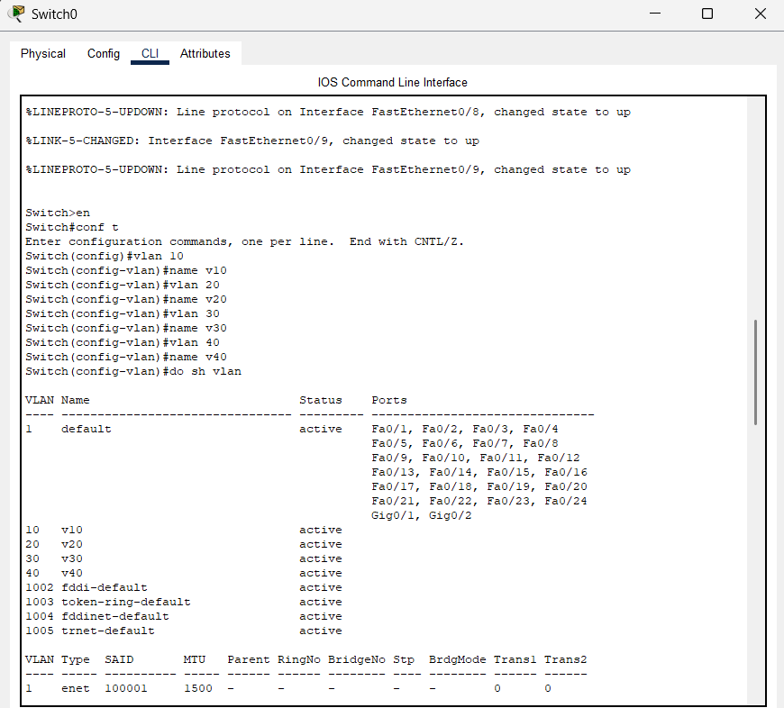
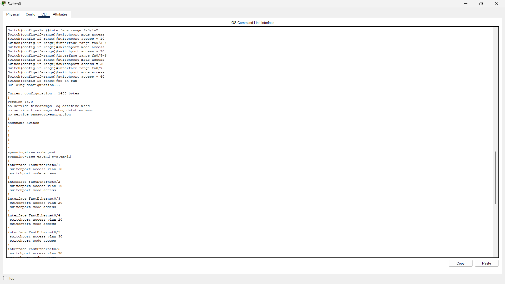
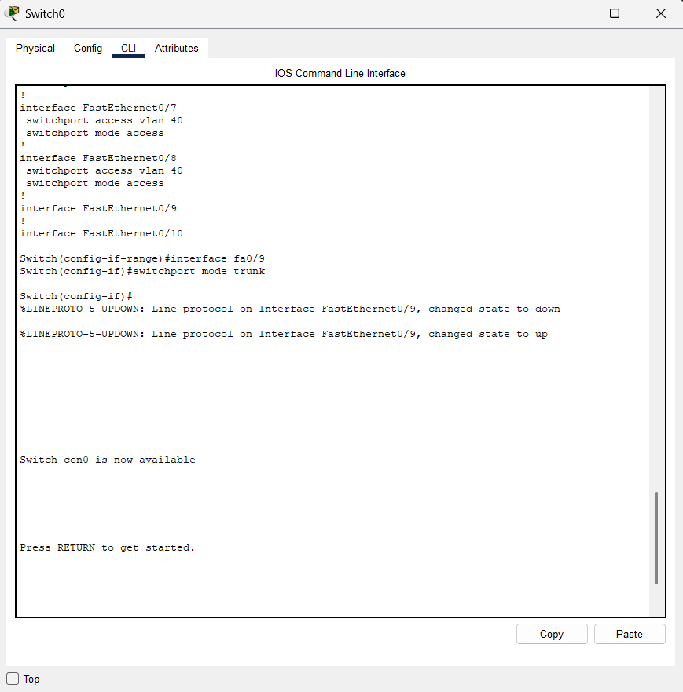
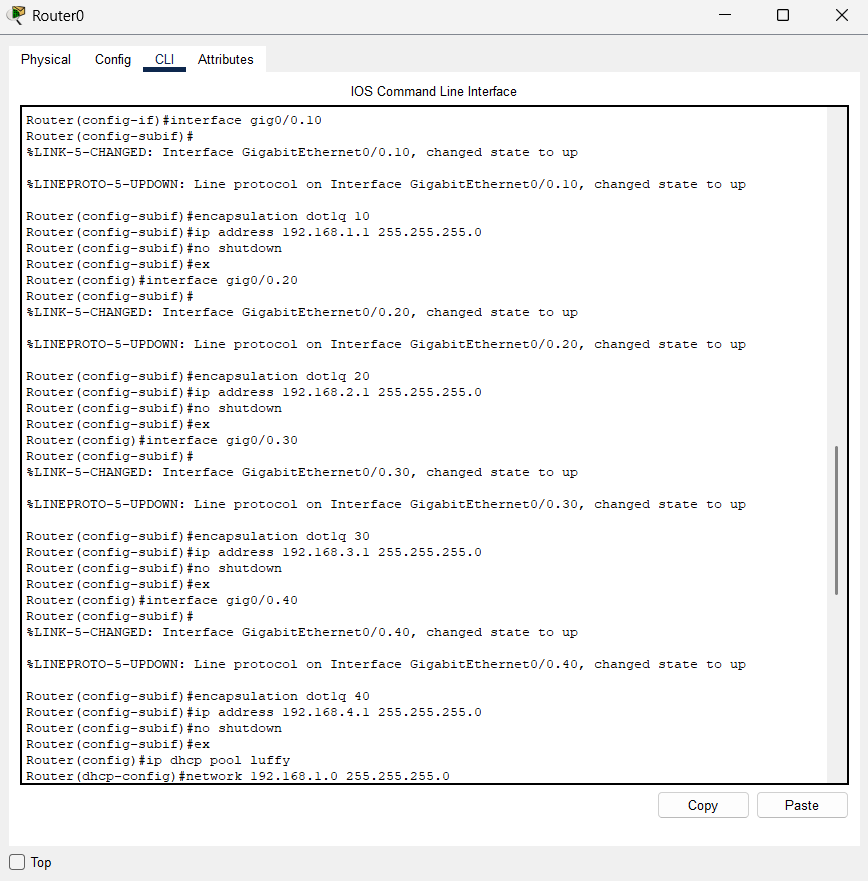
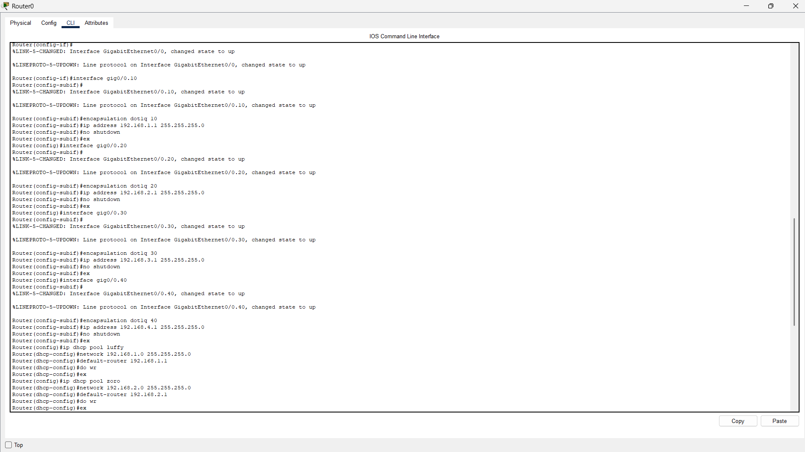

# VLAN Configuration with Router-on-a-Stick (CCNA Project)

This project demonstrates the implementation of multiple VLANs using a Layer 2 switch and inter-VLAN routing using a single router interface (Router-on-a-Stick) in Cisco Packet Tracer.

---

## Project Overview

- Created multiple VLANs on a switch
- Assigned end devices to different VLANs
- Configured a trunk link between switch and router
- Implemented inter-VLAN routing using router sub-interfaces
- Configured DHCP for automatic IP address assignment

---

## Network Design

- **Router:** Cisco Router (Router-on-a-Stick)
- **Switch:** Layer 2 Switch
- **End Devices:** PCs connected to different VLANs
- **Connection Type:** Trunk link between Router and Switch

---

## VLAN Details

| VLAN ID | VLAN Name | Network |
|-------|----------|--------|
| 10 | v10 | 192.168.1.0/24 |
| 20 | v20 | 192.168.2.0/24 |
| 30 | v30 | 192.168.3.0/24 |
| 40 | v40 | 192.168.4.0/24 |

---

## Configuration Summary

### Switch Configuration
- VLANs created using `vlan` command
- Access ports assigned to respective VLANs
- Trunk port configured using `switchport mode trunk`

### Router Configuration
- Sub-interfaces created for each VLAN
- `encapsulation dot1q` used for VLAN tagging
- IP addresses assigned to each sub-interface

### DHCP Configuration
- Separate DHCP pools created for each VLAN
- Default gateway configured for each subnet

---

## Outcome

- Successful VLAN segmentation  
- Inter-VLAN communication enabled via router  
- PCs received IP addresses dynamically using DHCP  
- Network functioning as expected  

---

## Screenshots

### Network Topology

### VLAN Creation

### Access Port Configuration

### Trunk Port Configuration

### Router Sub-Interface Configuration

### DHCP Configuration

---

